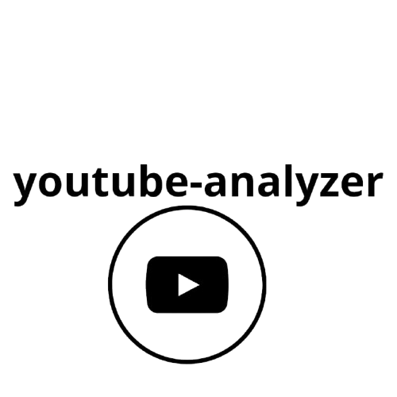

<div align="center">
    
  
  
  
  

<i>A biblioteca `YouTube Analyzer` facilita a extração e análise de metadados de vídeos públicos no YouTube. Além disso, permite o download de vídeos e legendas, análise de playlists, e filtragem de URIs de vídeo e áudio.
</i>
  
  ---
</div>

>[!Warning]  
> **Atenção:** Utilize esta biblioteca de forma responsável. Não compartilhe vídeos ou áudios baixados sem a devida autorização do proprietário. O foco da `youtube-analyzer` não é o download de vídeos/áudios, e erros podem ocorrer durante esses processos. A biblioteca se concentra na extração de informações de vídeos.


---
# Sumário
- [Informações gerais sobre um vídeo](#informações-gerais-sobre-um-vídeo)
- [Informações sobre uma playlist](#informações-sobre-uma-playlist)
  - [Obtendo todos os vídeos de uma playlist](#obtendo-todos-os-vídeos-de-uma-playlist)
- [Legendas](#legendas)
  - [Tradução de legendas](#tradução-de-legendas)
  - [Baixar legendas](#baixar-legendas)
- [Streams](#streams)
  - [Obtendo todas as resoluções disponíveis no vídeo](#obtendo-todas-as-resoluções-disponíveis-no-vídeo)
  - [Obtendo todas as qualidades de áudio disponíveis no vídeo](#obtendo-todas-as-qualidades-de-áudio-disponíveis-no-vídeo)
  - [Obtendo a melhor faixa de vídeo](#obtendo-a-melhor-faixa-de-vídeo)
  - [Obtendo a melhor faixa de áudio](#obtendo-a-melhor-faixa-de-áudio)
  - [Filtrando streams de vídeo](#filtrando-streams-de-vídeo)
  - [Filtrando streams de áudio](#filtrando-streams-de-áudio)
  - [Baixando streams](#baixando-streams)
    - [Exemplo: baixar faixa que contém áudio e vídeo](#exemplo-baixar-faixa-que-contém-áudio-e-vídeo)
  - [Exeções](#-exceções)
    

---

### Informações gerais sobre um vídeo

```python
from youtube_analyzer import VideoMetadates
yt = VideoMetadates()
video_info = yt.get_video_info(url_video='url-video')

print("Título:", video_info.title)
print("Objeto Streams:", video_info.uris_stream)
print("Objeto CaptionsParser:", video_info.Captions)
print("Autor:", video_info.author)
print("Descrição:", video_info.description)
print("É privado:", video_info.is_private)
print("Miniaturas:", video_info.thumbnails)
print("Contagem de visualizações:", video_info.viewCount)
```

---

### Informações sobre uma playlist

```python
from youtube_analyzer import PlaylistMetadates
pl = PlaylistMetadates()

pl_info = pl.get_playlist_info(playlist_url='url-playlist')  # PlaylistContent

# Exibindo os detalhes da playlist
print("Privada:", pl_info.is_private)
print("Descrição:", pl_info.description)
print("Título:", pl_info.playlist_name)
print("Imagem:", pl_info.image)
print("Quantidade de vídeos:", pl_info.count) 
print("Visualizações:",pl_info.views)
print("Canal:",pl_info.channel_name)
print("Última atualização:",pl_info.last_updated)
```

---

### Obtendo todos os vídeos de uma playlist

```python
from youtube_analyzer import PlaylistMetadates
pl = PlaylistMetadates()

pl_info = pl.get_playlist_info(playlist_url='url-playlist')  # PlaylistContent

# Obtendo a lista de vídeos
videos = pl_info.get_all_videos()  # Retorna uma lista de dicionários com informações dos vídeos

# Exibindo a lista de vídeos
for video in videos:
    print(f"Título: {video['title']}, URL: {video['url']}")
```

---

### Legendas

Você pode obter legendas de um vídeo:

```python
from youtube_analyzer import VideoMetadates
yt = VideoMetadates()
video_info = yt.get_video_info(url_video='url-video')

captions = video_info.Captions.get_caption_for_video()
lang = captions.lang# código da linguagem
url_caption = captions.url # url da legenda
content_caption = captions.content # conteúdo da legenda
transcript = captions.transcript() # trasnscrição
```

---

### Tradução de legendas

> **AVISO**  
> O parâmetro `tlang` deve estar no padrão ISO 639-1.

```python
from youtube_analyzer import VideoMetadates
yt = VideoMetadates()
video_info = yt.get_video_info(url_video='url-video')

captions = video_info.Captions.translate(tlang='pt')
lang = captions.lang
url_caption = captions.url
content_caption = captions.content
```

---

### Baixar legendas

Se deseja baixar a legenda, é simples:

```python
from youtube_analyzer import VideoMetadates
yt = VideoMetadates()
video_info = yt.get_video_info(url_video='url-video')

# Baixando legendas traduzidas
captions = video_info.Captions.translate(tlang='pt')
captions.download(output_dir='captions', logs=True)

# Baixando uma legenda de um vídeo
captions_in_video = video_info.Captions.get_caption_for_video()
captions.download(output_dir='captions', logs=True)
```

---

### Streams

A biblioteca `youtube_analyzer` facilita o trabalho com streams e seus metadados. Veja a seção [Streams](man.md) para mais detalhes de cada tipo de objeto.

---

### Obtendo todas as resoluções disponíveis no vídeo

```python
from youtube_analyzer import VideoMetadates
yt = VideoMetadates()
video_info = yt.get_video_info(url_video='url-video')

resolutions = video_info.uris_stream.get_resolutions()
```

---

### Obtendo todas as qualidades de áudio disponíveis no vídeo

```python
from youtube_analyzer import VideoMetadates
yt = VideoMetadates()
video_info = yt.get_video_info(url_video='url-video')

audio_qlt = video_info.uris_stream.get_all_audios_quality()
```

---

### Obtendo a melhor faixa de vídeo

```python
from youtube_analyzer import VideoMetadates
yt = VideoMetadates()
video_info = yt.get_video_info(url_video='url-video')

highest_resolution = video_info.uris_stream.get_highest_resolution()  # VideoStream
```

---

### Obtendo a melhor faixa de áudio

```python
from youtube_analyzer import VideoMetadates
yt = VideoMetadates()
video_info = yt.get_video_info(url_video='url-video')

best_audio_quality = video_info.uris_stream.get_best_audio_quality()  # AudioStream
```

---

### Obtendo a stream que contém áudio e vídeo

```python
from youtube_analyzer import VideoMetadates
yt = VideoMetadates()
video_info = yt.get_video_info(url_video='url-video')

contained_audio = video_info.uris_stream.get_format_contained_audio()  # VideoStream
```

---

### Filtrando streams de vídeo

```python
from youtube_analyzer import VideoMetadates
yt = VideoMetadates()
video_info = yt.get_video_info(url_video='url-video')

my_filter = video_info.uris_stream.filter_resolution(resolution_filter='1280x720', typeuri='video/mp4')
if my_filter:
    print("#VideoStream!")
```

---

### Filtrando streams de áudio

```python
from youtube_analyzer import VideoMetadates
yt = VideoMetadates()
video_info = yt.get_video_info(url_video='url-video')

my_filter = video_info.uris_stream.filter_audio_quality(audio_quality='AUDIO_QUALITY_MEDIUM', type_audio='audio/mp4')
if my_filter:
    print("#AudioStream!")
```

---

### Baixando streams

Para baixar faixas de áudio ou vídeo, basta chamar os métodos:  
`download_audio()` para objetos `AudioStream`  
`download_video()` para objetos `VideoStream`

---

### Exemplo: baixar faixa que contém áudio e vídeo

```python
from youtube_analyzer import VideoMetadates
yt = VideoMetadates()
video_info = yt.get_video_info(url_video='url-video')

video_info.uris_stream.get_format_contained_audio().download_video(
    title='tester', output_dir='.', logs=True
)
```
---

### Exceções

- `YoutubeAnalyzerExceptions`: Exceção base para a biblioteca. 
- `InvalidIdUrlYoutube`: Exceção para URLs ou IDs inválidos. 
- `NotCaptions`: Exceção para vídeos sem legendas. 
- `YoutubeRequestError`: Exceção para erros em requisições. 
- `TranslationNotRequiredError`: Exceção para traduções desnecessárias.
- `InvalidPlaylistError`: Exceção para playlists privadas ou inválidas.
- `TransCribeError`: Exceção levantada quando não foi possível obter a trasncrição.
