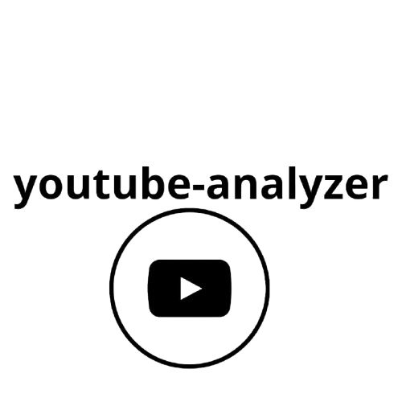

    

Obtenha detalhes de vídeos do youtube usando esta lib
---
- [x] Obter detalhes de um vídeo
- [x] obter legendas
- [x] Analizar playlists
- [x] Obter detalhes de uris de Vídeos
- [x] Downloads de audios e vídeos